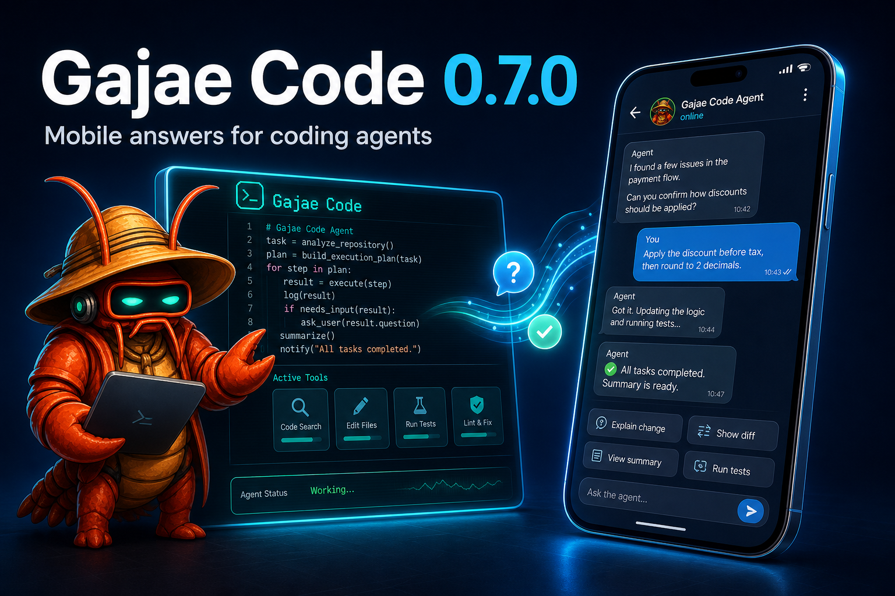

<p align="center">
  
</p>

<h1 align="center">Gajae-Code</h1>

<p align="center">
  <strong>Encode intention. Decode software.</strong><br />
  이미 결제 중인 구독 플랜으로 돌아가고, 휴대폰으로 답할 수 있는 코딩 에이전트.
</p>

<p align="center">
  <a href="https://gajae-code.com"></a>
  <a href="https://www.npmjs.com/package/gajae-code"></a>
  <a href="LICENSE"></a>
  <a href="https://discord.gg/8vPXmxSt9"></a>
</p>

<p align="center">
  <a href="README.md">English</a> | 한국어 | <a href="README.zh-CN.md">中文</a> | <a href="README.ja.md">日本語</a>
</p>

> Gajae-Code는 실험적인 베타 단계 프로젝트입니다. 거친 부분이 있을 수 있으니 중요한 작업에는 출력을 검증한 뒤 사용하세요.
>
> 이 문서는 영어 [README.md](README.md)의 번역본입니다. 내용이 다르면 영어 버전이 기준(SSOT)입니다.

Gajae-Code(`gjc`)는 외부 코딩 에이전트 하네스입니다. 아무 저장소나 워크트리에서 실행하고, 변경 전에 계획하고, 증거와 함께 실행하며, 터미널·휴대폰·자체 봇 어디서든 통제할 수 있습니다.

## 쓰던 코딩 플랜 그대로

한 번 로그인하면 이미 구독 중인 플랜으로 GJC를 돌릴 수 있습니다. 별도 API 과금이 필요 없습니다 — 세션 안에서 `/login`을 실행하고 프로바이더를 고르세요:

| 플랜 / 구독 | OAuth 로그인 |
| --- | --- |
| Claude Pro / Max | `anthropic` |
| ChatGPT Plus / Pro (Codex) | `openai-codex` (브라우저) · `openai-codex-device` (헤드리스) |
| Google Gemini CLI (Cloud Code Assist) | `google-gemini-cli` |
| GitHub Copilot | `github-copilot` |
| GitLab Duo | `gitlab-duo` |
| Cursor | `cursor` |
| Z.AI GLM Coding Plan | `zai` |
| Kimi Code / Coding Plan / Moonshot | `kimi-code` · `moonshot` |
| Fire Pass (Fireworks Kimi K2.6 Turbo 구독) | `firepass` |
| OpenCode Zen / OpenCode Go | `opencode-zen` · `opencode-go` |
| MiniMax Coding Plan (해외 / 중국) | `minimax-code` · `minimax-code-cn` |
| Alibaba Token Plan / Qwen Portal | `alibaba-token-plan` · `qwen-portal` |
| Xiaomi Token Plan (싱가포르 / 유럽 / 중국) | `xiaomi-token-plan-*` |
| Perplexity Pro / Max | `perplexity` |
| Command Code GOAT 코딩 플랜 | `gjc setup` 프리셋 `commandcode-goat` (`CMD_API_KEY`) |

OAuth 플랜 외에도 API 키, 로컬 런타임(Ollama, LM Studio, vLLM), 게이트웨이(Cloudflare AI Gateway, Vercel AI Gateway, LiteLLM 등)로 50개 이상의 프로바이더를 쓸 수 있습니다. `models.yml`에 자체 엔드포인트를 등록하고, 프로바이더당 여러 계정을 사용량 기반으로 라우팅하고, 모델 프리셋/프로필로 역할별 벤더를 섞거나, auth 브로커/게이트웨이로 팀 자격증명을 중앙화하세요.

- [모델·프로바이더·인증 해석 순서](docs/models.md)
- [커스텀 프로바이더 & 멀티 계정 라우팅](docs/custom-providers-and-multi-account.md)
- [멀티 벤더 역할 프로필](docs/multi-vendor-profiles.md)
- [Auth 브로커 & 게이트웨이 (팀 공용 자격증명)](docs/auth-broker-gateway.md)

## 휴대폰으로 답하기

<p align="center">
  
</p>

에이전트가 결정을 요청하면 텔레그램으로 알림이 오고, 어디서든 답할 수 있습니다:

- **세션별 포럼 토픽** — 실시간/최종 출력, 컨텍스트 업데이트, 이미지 첨부, 인라인 버튼, 자유 텍스트 답장, 타이핑 표시.
- **한 번만 설정** — 실행 중인 세션의 `/settings` → Notifications에서, 또는 헤드리스로 `gjc notify setup|status|health|test|recovery`. 토큰은 입력 시 마스킹되고 이후 절대 표시되지 않습니다.
- **`gjc daemon`** — 봇 토큰당 하나의 안전한 long-poll 소유자를 유지해 새 세션이 텔레그램 409 충돌 없이 깔끔하게 붙습니다.
- Discord와 Slack 전달도 함께 제공됩니다. 범용 `action_needed`/`reply` 프로토콜로 어떤 봇/모바일 앱이든 터미널 스크래핑 없이 답을 되돌릴 수 있습니다.

- [텔레그램 온보딩](docs/telegram-onboarding.md) · [Discord](docs/discord-onboarding.md) · [Slack](docs/slack-onboarding.md)

## 토큰을 덜 쓰기

GJC는 토큰 비용의 양쪽을 모두 최적화합니다:

- **캐시 히트** — 프로바이더별 `cacheRetention` 제어. Anthropic은 짧은 캐시가 긴 에이전트 실행에 취약하므로 기본이 장기(1시간) 캐시 유지입니다. 프로바이더 랭킹은 저렴한 `cacheRead` 경로를 우선하고, 옵트인 session-affinity 헤더로 OpenAI 호환 릴레이가 서버측 프롬프트 캐시를 재사용할 수 있습니다.
- **컨텍스트 절약** — 파일 읽기는 전체 파일 대신 구조 요약을 반환하고, 과대한 셸 출력은 컨텍스트를 채우는 대신 최소화되어 회수 가능한 `artifact://` 참조로 넘어갑니다. 컴팩션과 브랜치 요약이 긴 세션을 윈도 안에 유지하면서 이전 작업 맥락을 잃지 않게 합니다.

- [캐시 유지 & 프로바이더 호환](docs/models.md) · [컴팩션 & 브랜치 요약](docs/compaction.md)

## 변경 전에 계획

의도적으로 작은 워크플로 표면 — 스킬 4개, 역할 에이전트 4개, 그 이상은 없습니다:

```text
deep-interview -> ralplan -> ultragoal
                         └─ 병렬 tmux 워커가 도움이 될 때만 선택적 team 실행
```

| 표면 | 역할 |
| --- | --- |
| `deep-interview` | 모호한 요청을 구체적인 요구사항으로 바꿉니다. |
| `ralplan` | 코드 변경 전에 구현 계획을 세우고 비평합니다. |
| `ultragoal` | 실행·수정·검증·증거까지 목표를 추적합니다. |
| `team` | 병렬화가 가치 있을 때 tmux 기반 워커를 조율합니다. |
| `executor` / `architect` / `planner` / `critic` | 구현 및 읽기 전용 리뷰 레인을 위한 번들 역할 에이전트. |

옵트인 기능: **`gjc rlm`** (노트북과 리포트를 합성하는 Jupyter 스타일 리서치/REPL 모드), **`computer-use`** (실험적 데스크톱 제어). [Python REPL](docs/python-repl.md), [docs/tools/computer.md](docs/tools/computer.md) 참고.

## 설치

```sh
bun install -g gajae-code
gjc
```

프리빌드 바이너리는 Linux(x64/arm64), macOS(arm64/x64), Windows(x64)를 지원하며 npm/Bun 경로는 모든 플랫폼에서 동작합니다. 나이틀리 채널: `bun install -g gajae-code@nightly`.

전체 설치 매트릭스, Windows 설정, 업데이트 채널, 셸 자동완성: [docs/install.md](docs/install.md).

## 빠른 시작

```sh
gjc                                # 현재 체크아웃에서 실행
gjc --tmux                         # tmux 기반 리더 세션
gjc --tmux --worktree my-task      # 위험한 작업을 위한 격리 워크트리
gjc @screenshot.png "뭘 바꿔야 할까?"   # 이미지 입력
```

세션 안에서:

```text
/login                       프로바이더 / 코딩 플랜 선택
/skill:deep-interview        모호한 요구사항 명확화
/skill:ralplan               계획 수립 및 비평
gjc ultragoal create-goals --brief-file <승인된-계획>
```

## OpenClaw / Hermes가 GJC를 부리게 하기

GJC는 네이티브 Coordinator MCP 브리지를 내장하고 있어 OpenClaw나 Hermes 같은 외부 컨트롤러가 터미널 스크래핑 없이 durable turn으로 실제 GJC 세션을 오케스트레이션합니다.

가이드를 읽을 필요 없이, 아래 프롬프트를 OpenClaw/Hermes 컨트롤러에 붙여넣으면 스스로 연결을 구성합니다:

```text
Set up Gajae-Code (gjc) as your coding-agent backend on this machine. gjc is already installed.

1. Render and install the coordinator MCP setup package (replace the paths):
   gjc setup hermes --root <ABS_REPO_PATH> --profile <PROFILE_NAME> --repo <REPO_NAME> \
     --mutation sessions,questions,reports --profile-dir <YOUR_PROFILE_DIR> --install
   Without --install the command is render-only; re-run with --install to write files.

2. Verify the contract (non-mutating, no LLM call). Both must report ok:
   gjc setup hermes --root <ABS_REPO_PATH> --smoke
   gjc mcp-serve coordinator --check --json

3. Register the MCP server from the installed config. It is equivalent to:
   command: gjc, args: ["mcp-serve", "coordinator"]
   env: GJC_COORDINATOR_MCP_WORKDIR_ROOTS=<ABS_REPO_PATH>,
        GJC_COORDINATOR_MCP_PROFILE=<PROFILE_NAME>,
        GJC_COORDINATOR_MCP_REPO=<REPO_NAME>,
        GJC_COORDINATOR_MCP_SESSION_COMMAND="gjc --worktree",
        GJC_COORDINATOR_MCP_MUTATIONS=sessions,questions,reports

4. To delegate coding work, prefer one call per workflow:
   gjc_delegate_plan / gjc_delegate_execute / gjc_delegate_team
   with { cwd, task, allow_mutation: true, idempotency_key: <fresh-uuid> }.
   Each starts an isolated worktree session and returns a durable turn_id and artifacts.

5. For finer control: gjc_coordinator_start_session -> gjc_coordinator_send_prompt ->
   poll gjc_coordinator_read_turn or bounded gjc_coordinator_await_turn ->
   answer gjc_coordinator_list_questions rows via gjc_coordinator_submit_question_answer ->
   close with gjc_coordinator_report_status.

Rules: every mutating call needs allow_mutation: true plus a fresh idempotency_key.
Treat durable turn state as authoritative; never scrape terminal output.
The session command selector accepts only "gjc" or "gjc --worktree [name]".
```

라이브 세션 하나를 직접 다루는 컨트롤러를 위해 모든 세션은 루프백 **SDK WebSocket** 엔드포인트, `gjc sdk session` CLI(`list|inspect|send|status|tail`), 번들 `sdk-skills/`(`gjc-sdk-discover` · `gjc-sdk-operate` · `gjc-sdk-author`)를 함께 노출합니다 — 컨트롤러에 올라탄 에이전트가 따라갈 수 있는, 검토되고 승인 게이트가 있는 절차입니다.

- [외부 컨트롤러 통합 가이드](docs/bot-integration.md) · [Coordinator MCP 브리지](docs/hermes-mcp-bridge.md)
- [SDK & 와이어 프로토콜](docs/sdk.md) · [SDK 세션 CLI](docs/sdk-session-cli.md) · [외부 제어 준비도](docs/external-control-readiness.md)

## 문서

**[gajae-code.com](https://gajae-code.com)** 또는 `docs/`에서 시작하세요:

- [설치 & 업데이트](docs/install.md) · [환경 변수](docs/environment-variables.md) · [키바인딩](docs/keybindings.md) · [테마](docs/theme.md)
- [모델 & 프로바이더](docs/models.md) · [커스텀 프로바이더 & 멀티 계정 라우팅](docs/custom-providers-and-multi-account.md) · [멀티 벤더 프로필](docs/multi-vendor-profiles.md) · [Auth 브로커](docs/auth-broker-gateway.md)
- [텔레그램](docs/telegram-onboarding.md) · [봇 통합](docs/bot-integration.md) · [SDK](docs/sdk.md) · [SDK 세션 CLI](docs/sdk-session-cli.md)
- [세션](docs/session.md) · [컴팩션](docs/compaction.md) · [메모리](docs/memory.md) · [시크릿](docs/secrets.md)
- [코드베이스 개요](docs/codebase-overview.md) · [기여 / 개발 환경](CONTRIBUTING.md)
- [macOS Option/Alt 키 설정 (iTerm2)](docs/macos-option-key.md) · [GEO 가시성 벤치마크](docs/geobench.md)

## SDK 확장

- [gjc-remote](https://github.com/kogangdon/gjc-remote) — Discord에서 원격 호스트의 allowlist된 GJC 세션 제어.
- [oh-my-gajae-code](https://github.com/devswha/oh-my-gajae-code) — 추가 스킬과 슬래시 커맨드를 위한 커뮤니티 플러그인 마켓플레이스.
- [GJC 멀티벤더 설정 가이드](https://github.com/project820/gjc-multivendor-setup-guide) — 멀티벤더 설정을 위한 역할 기반 프로바이더 프로필.

## 개발

```sh
bun install
bun run build:native
bun run dev:link       # 전역 `gjc`가 이 체크아웃의 소스를 실행
bun run dev:doctor     # 링크 검증
```

패키지 맵과 게이트는 [CONTRIBUTING.md](CONTRIBUTING.md)와 [docs/codebase-overview.md](docs/codebase-overview.md)를 참고하세요.

## 기여자 & 계보

[Yeachan-Heo](https://github.com/Yeachan-Heo), [IYENTeam](https://github.com/IYENTeam), [HaD0Yun](https://github.com/HaD0Yun), [probepark](https://github.com/probepark)에게 감사드립니다. GJC는 여러 에이전트 하네스에서 얻은 교훈 위에 세워졌으며, 역사적 어트리뷰션은 [NOTICE.md](NOTICE.md)에 있습니다.

## 라이선스

MIT. [LICENSE](LICENSE) 참고.
