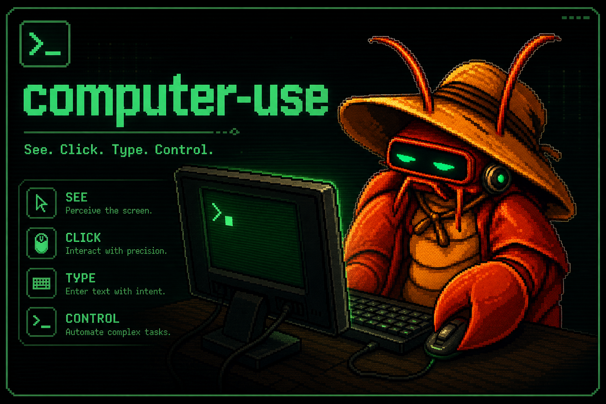

<p align="center">
  
</p>

<h1 align="center">Gajae-Code</h1>

<p align="center">
  <strong>Encode intention. Decode software.</strong><br />
  A focused coding-agent runner for interviews, reviewed plans, tmux-native execution, and durable verification.
</p>

<p align="center">
  <a href="https://gajae-code.com"></a>
  <a href="https://www.npmjs.com/package/gajae-code"></a>
  <a href="LICENSE"></a>
  <a href="https://discord.gg/8vPXmxSt9"></a>
</p>

<p align="center">
  
</p>

> Gajae-Code is an experimental, beta-stage project. Expect rough edges and verify outputs before relying on it for important work.

## Recent highlights

<p align="center">
  
</p>

**Mobile answers for coding agents** — Gajae-Code ships a configure-once
[Gajae-Code SDK](docs/sdk.md) and managed Telegram reference daemon. In a running
GJC session, open `/settings` → **Notifications** to configure or reconfigure
Telegram, manage health/test/recovery/reconnect, toggle global or current-session
delivery, and remove Telegram without disturbing Discord or Slack. Telegram tokens
are masked on entry and never displayed afterward.

For headless setup and automation, `gjc notify setup|status|health|test|recovery`
remains authoritative. Each session exposes a loopback WebSocket discovery file
and a generic `action_needed`/`reply` protocol so Telegram, Discord, Slack, mobile
apps, or local tools can surface pending asks and route answers back without
terminal scraping. The bundled Telegram flow adds a Threaded Mode per-session
surface with context updates, live/finalized output, image attachments, inline
buttons, free-text replies, typing indicators, and double-check acknowledgements.
`gjc daemon` keeps one safe long-poll owner per bot token so new sessions attach
cleanly instead of tripping Telegram 409 conflicts; a foreign owner is never taken
over.

## Research and desktop-control highlights

<p align="center">
  
</p>

**`rlm`** — an opt-in research/REPL mode. A Jupyter-notebook-style research session over the agent loop, backed by the shared persistent Python kernel with a hard-gated `python` + `read` + `web_search` toolset. Runs aggregate into `.gjc/rlm/<session>/notebook.ipynb` and synthesize a `report.md` on exit. Start it with `gjc rlm`.

<p align="center">
  
</p>

**`computer-use`** — an experimental, opt-in desktop-control tool surface. Backed by native screenshot/input bindings and gated through settings/tool registration, it lets the agent see the screen and drive mouse/keyboard for local desktop coordination.

## Website

Visit **[gajae-code.com](https://gajae-code.com)** for the Gajae Code landing page, quick-start guide, architecture overview, harness notes, SDK docs, skills, receipts, remote-control design, and troubleshooting.

## What is Gajae-Code?

Gajae-Code (`gjc`) is an external coding-agent harness. It runs from the repository or worktree you choose, then gives the agent a small, explicit workflow surface:

```text
deep-interview -> ralplan -> ultragoal
                         └─ optional team execution when parallel tmux workers help
```

<p align="center">
  
</p>

It is intentionally not a hidden plugin for Codex CLI, Claude Code, OpenCode, or Claw Code. Start `gjc` beside those tools when you want structured planning, persistent evidence, tmux-backed workers, or an isolated worktree.

## Install

```sh
bun install -g gajae-code
```

The scoped package is also available as `@gajae-code/coding-agent`.

### Nightly channel

A verified nightly prerelease is published from `main` at 04:23 UTC and can also be started manually with the **nightly-release** CI dispatch. Nightly runs execute the complete main verification graph, build every supported native addon and standalone binary, publish the exact package set under the npm `nightly` dist-tag, and create a matching GitHub prerelease with package evidence. They do not move npm `latest`, rewrite `main`, or consume the `[Unreleased]` changelog sections.

```sh
bun install -g gajae-code@nightly
gjc --version
gjc --smoke-test
```

Already on GJC? Switch channels without reinstalling: `gjc update --channel nightly` moves to the latest nightly, and `gjc update --channel stable` switches a nightly install back to the latest stable (the command detects the channel switch and installs even though stable is semver-lower than the nightly). To make a channel the default for both `gjc update` and the startup update check, set **Settings → Interaction → Update Channel** (the `startup.updateChannel` setting). In the brief window where a nightly shares the stable core version, add `--force` to move onto it.

### Shell completion

GJC can generate a Fig/withfig-compatible spec for [Microsoft inshellisense](https://github.com/microsoft/inshellisense):

```sh
gjc completion inshellisense --install
```

The installer writes `gjc.js` plus a minimal `index.js` into inshellisense's default local spec directory (`~/.fig/autocomplete/build`). If that directory already has an unrelated `index.js`, GJC refuses to clobber it unless `--force` is explicit; use `--dir <path>` for a separate GJC-only spec directory.

### Supported platforms

Prebuilt standalone release binaries are published only for:

- **Linux** — x64 and arm64
- **Windows** — x64
- **macOS** — Apple Silicon (arm64) and Intel (x64)

The npm/Bun package path and build-from-source also remain available on every platform.

### macOS Intel install

Standalone release binaries are published for both Apple Silicon (`gjc-darwin-arm64`) and Intel (`gjc-darwin-x64`) macOS. You can also install through the npm/Bun package path or build from source:

```sh
bun install -g gajae-code
# or
curl -fsSL https://raw.githubusercontent.com/Yeachan-Heo/gajae-code/main/scripts/install.sh | sh -s -- --source
```

### Windows (native install)

On a clean Windows 11 machine, install Bun first, then install `gjc` with Bun's
global installer:

```powershell
# 1. Install Bun
powershell -c "irm bun.sh/install.ps1|iex"

# 2. Restart the terminal so PATH and the Bun runtime refresh, then confirm Bun
bun --version

# 3. Install and verify gjc
bun install -g gajae-code
gjc --version
gjc --smoke-test
```

`bun install -g` places the `gjc` launcher in `%USERPROFILE%\.bun\bin`. That
directory must be on `PATH` for `gjc` to resolve as a command. Bun's installer
adds it automatically, but the change only applies to terminals started after
installation — restart PowerShell (or sign out/in) if `gjc` is "not recognized".

Troubleshooting:

- **`gjc` reports an old Bun runtime.** Re-run the Bun installer above, restart
  the terminal, and confirm `bun --version` matches what `gjc --version`
  expects. If an older Bun still wins, make sure `%USERPROFILE%\.bun\bin` is
  first on `PATH` and remove any stale Bun installs shadowing it.
- **`gjc.exe` exists but `gjc` is "not recognized".** The launcher is installed
  but not on `PATH`. Confirm `%USERPROFILE%\.bun\bin` is listed in
  `echo $env:Path`, then restart the terminal.
- **`gjc --tmux` starts without a tmux-backed session.** Native Windows needs a
  tmux-compatible executable on `PATH`. For GJC-managed session/team guarantees,
  use WSL with real tmux, or another provider that round-trips tmux user options
  such as `@gjc-profile`. Native psmux can provide `tmux`/`pmux`/`psmux`
  commands, but that path is not fully supported for GJC ownership tags and team
  guarantees yet; see `docs/environment-variables.md#interactive---tmux-startup-and-scrollmouse-profile`.

## Quick start

```sh
# Run directly in the current checkout
gjc

# Use a tmux-backed leader session
gjc --tmux

# Use an isolated worktree for risky or reviewable work
# --worktree takes an optional branch-like name, not a filesystem path.
gjc --tmux --worktree my-task-branch

# If you already created a worktree directory, launch from that directory instead.
cd ../my-task-worktree && gjc --tmux
```

### Image input

GJC accepts images in two ways:

- **CLI startup**: prefix a local image path with `@`, for example `gjc @screenshot.png "What should I change?"`.
- **Interactive TUI**: copy an image to the system clipboard and use the configured **Paste image from clipboard** key (Ctrl+V on Linux/macOS, Alt+V on Windows), or type `#paste-image` and choose the prompt action. When the clipboard is unavailable, paste or pass the image file path with `@path/to/image.png` instead.

Type `#` in the interactive editor to open prompt actions. In a tmux-backed session, choose **Scroll to previous user input** (for example via `#prev`) to enter tmux copy-mode at the previous rendered user message.

Inside a GJC session, use the public workflow surface:

```text
/skill:deep-interview clarify ambiguous requirements
/skill:ralplan build and critique the implementation plan
gjc ultragoal create-goals --brief-file <approved-plan>
gjc ultragoal complete-goals
```

Add `gjc team ...` only when coordinated tmux workers materially help.

## Core capabilities

- **Interview before guessing**: `deep-interview` turns vague requests into concrete requirements.
- **Plan before mutation**: `ralplan` reviews the approach before code changes.
- **Execute with evidence**: `ultragoal` tracks goals, revisions, checks, and completion evidence.
- **Parallelize when useful**: `team` coordinates tmux-backed workers for larger tasks.
- **Stay external and reviewable**: run from a chosen repo or worktree without patching another agent runtime.

## Workflow surface

Gajae-Code ships four default workflow skills:

| Skill            | What it does                                                          |
| ---------------- | --------------------------------------------------------------------- |
| `deep-interview` | Clarifies ambiguous requirements before planning or code changes.     |
| `ralplan`        | Builds and critiques an implementation plan before mutation.          |
| `ultragoal`      | Tracks goals through execution, revision, verification, and evidence. |
| `team`           | Coordinates tmux-backed workers when parallel execution is worth it.  |

And four bundled role agents:

| Agent       | What it does                                       |
| ----------- | -------------------------------------------------- |
| `executor`  | Bounded implementation, fixes, and refactors.      |
| `architect` | Read-only architecture and code-review assessment. |
| `planner`   | Read-only sequencing and acceptance criteria.      |
| `critic`    | Read-only plan critique and actionability review.  |

No sprawling default skill zoo: GJC improves by making this small method better.

### Skill migration and bundled skill inspection

When moving a workflow into GJC, inspect the bundled defaults before installing or overwriting anything:

```sh
gjc skills list
gjc skills read ralplan
gjc setup defaults --check
```

`gjc setup defaults` installs the four bundled GJC workflow skills into your user `.gjc` directory and preserves existing local files by default. If `--check` reports missing or different files, compare the embedded copy with `gjc skills read <name>` first; use `gjc setup defaults --force` only when you intentionally want to replace local default workflow skill files.

## Works beside your existing agent or bot

| Tool or bot | Recommended GJC command | Boundary |
| ----------- | ----------------------- | -------- |
| Codex CLI | `gjc --tmux --worktree <name>` or `gjc` | `--worktree` names a GJC-managed sibling worktree; for an existing path, `cd` there first. |
| Claude Code | `gjc --tmux` or `gjc --tmux --worktree <name>` | GJC does not become a Claude Code extension. |
| OpenCode | `gjc` or `gjc --tmux` | External-runner workflow only today. |
| Claw Code | `gjc --tmux --worktree <name>` | GJC does not install into or replace Claw Code. |
| External controller / bot | SDK WebSocket for a live session; `gjc daemon session` CLI or generated `sdk-skills/` guidance for scripts | External controllers use the SDK loopback protocol (`docs/sdk.md`) or its pure-SDK clients, not scrollback scraping. The host-neutral `gjc-sdk-*` skills are trusted-local procedural guidance and install no coordinator integration. |

For evaluating Aside as an opt-in search/context retrieval sidecar, see [`docs/aside-integration.md`](docs/aside-integration.md). For generic third-party bot setup and provider-independent smokes, see [`docs/bot-integration.md`](docs/bot-integration.md). For external-control readiness, see [`docs/external-control-readiness.md`](docs/external-control-readiness.md). For the wire protocol and machine interfaces, see [`docs/sdk.md`](docs/sdk.md).

## SDK Extensions

- [gjc-remote](https://github.com/kogangdon/gjc-remote) — a real-world SDK extension for controlling allowlisted GJC sessions on remote hosts from Discord.
- [oh-my-gajae-code](https://github.com/devswha/oh-my-gajae-code) — a community plugin marketplace for installing additional workflow skills and slash commands.
- [GJC multivendor setup guide](https://github.com/project820/gjc-multivendor-setup-guide) — role-based provider profiles and installable model bundles for multivendor GJC setups.

## Configuration

Provider retry budgets live in `~/.gjc/config.yml`:

```yaml
retry:
  requestMaxRetries: 4
  streamMaxRetries: 100
  maxRetries: 3
  maxDelayMs: 300000
```

`requestMaxRetries` applies before a stream is established. `streamMaxRetries` applies only to replay-safe transient stream failures. Invalid auth, unsupported models/providers, malformed requests, context overflow, user aborts, and permanent quota failures remain fail-fast.

### Launch-time updates

Interactive startup checks the npm registry for a newer GJC version in the background by default. This check is notify-only and non-mutating: GJC never installs or replaces itself during launch. For a recognized Bun global install, use `gjc update` or `bun install -g @gajae-code/coding-agent@latest`. For a recognized Windows npm install, use `gjc update` or the original npm package workflow. For a supported standalone binary installed by the bundled installer, use `gjc update` or rerun the documented platform installer. For a source checkout or `dev:link` executable, update, pull, build, and link through that checkout's original workflow. For unrecognized npm, pnpm, other package-manager installs, or unknown PATH targets, use the original package manager or install method.

Run `gjc config set startup.checkUpdate false` to disable the launch-time check. Registry or network failures are ignored so they do not block startup.

Both the launch-time check and `gjc update` resolve the registry the way npm does — `BUN_CONFIG_REGISTRY` or `npm_config_registry` from the environment, a scoped `@gajae-code:registry` key, then your user and machine-wide `.npmrc`, including the credentials registered for that registry. A mirrored or firewalled network is therefore checked at the same place the update would install from. A `.npmrc` in the current working directory is deliberately ignored, so a repository you have cloned cannot redirect the check or choose the credential it carries. `bunfig.toml` is not read, so a mirror declared only there is still checked against the public registry.

### Good to read together

- [GJC multivendor setup guide](https://github.com/project820/gjc-multivendor-setup-guide) — a community guide for role-based provider/profile selection across Anthropic, OpenAI/Codex, Google/Gemini, xAI/Grok, and opencode-go. Treat its presets as user-level configuration guidance rather than bundled defaults; verify model availability and provider auth in your own environment before adopting them.

## TUI identity

The default dark TUI identity is the GJC red-claw theme, while light-appearance terminals default to the bundled blue-crab theme. Three additional bundled migration themes — `claude-code`, `codex`, and `opencode` — mirror the look of those tools for easy eye-migration and are selectable from Settings or `/theme`. Explicit user theme settings still win.

### Bundled theme grid

Pick from Settings (`Appearance -> Dark theme` / `Light theme`) or `/theme`.

| Theme | Visual feel | Best fit |
| --- | --- | --- |
| `red-claw` | Dark GJC default with warm red-claw accents and strong status contrast. | Native GJC identity for dark terminals. |
| `blue-crab` | Bright-terminal blue palette tuned for readable light slots. | Light terminal or OS appearance. |
| `claude-code` | Claude Code-inspired dark palette with terracotta and pink highlights. | Claude Code muscle memory without leaving GJC. |
| `codex` | Crisp dark blue-gray palette with sharper coding-session contrast. | A Codex-like dark workspace. |
| `opencode` | OpenCode-inspired dark palette with punchier terminal accents. | OpenCode muscle memory in the bundled picker. |

## Development

Install dependencies, build native bindings, and set up local defaults:

```sh
bun install
bun run build:native
bun run install:defaults
```

The `.node` binary for `@gajae-code/natives` is gitignored and required before any CLI invocation (`install:defaults`, `dev:link`, tests).

### Canonical: build and link the dev `gjc`

To make the global `gjc` command run **this checkout's TypeScript source** (hot to every edit, with skills/natives working), link it onto your `PATH`:

```sh
bun install
bun run dev:link
```

`dev:link` symlinks `gjc` → `packages/coding-agent/src/cli.ts` into `~/.local/bin` (override with `GJC_DEV_LINK_DIR`), replaces that managed target, warns and fails if another `gjc` still shadows it earlier on `PATH`, and runs `--smoke-test` to confirm `@gajae-code/natives` loads. Use `bun run install:dev` for the full bootstrap (install + link + `setup defaults`).

Check at any time whether your `gjc` has drifted (wrong source, or a compiled binary that can't load skills):

```sh
bun run dev:doctor
```

> Do **not** use the compiled binary for day-to-day development. `bun --cwd=packages/coding-agent run build` produces a standalone `dist/gjc`, but a `bun build --compile` binary cannot dynamically load `@gajae-code/natives`, so skills fail with `Cannot find module '@gajae-code/natives' from '/$bunfs/root/gjc'`. Running from source via `dev:link` avoids this. Build the binary only when validating a release.

Run the CLI from source directly without linking:

```sh
bun packages/coding-agent/src/cli.ts --help
```

Default workflow definitions live in source, not committed `.gjc` copies:

```text
packages/coding-agent/src/defaults/gjc/skills/<name>/SKILL.md
packages/coding-agent/src/prompts/agents/<role>.md
```

For workflow-definition or rebrand-surface changes, run the project gates:

```sh
bun scripts/check-visible-definitions.ts
bun scripts/verify-g002-gates.ts
bun scripts/rebrand-inventory.ts --strict
bun test packages/coding-agent/test/default-gjc-definitions.test.ts
```

For future UI, dashboard, terminal, and TUI visual work, follow the repo-owned [UI design and visual QA workflow](docs/ui-design-visual-qa.md) before broad product-screen implementation.

For a package-by-package map, see [`docs/codebase-overview.md`](docs/codebase-overview.md).

## Contributors

Thanks to the people and agents helping shape the early Gajae-Code releases, including [Yeachan-Heo](https://github.com/Yeachan-Heo), [IYENTeam](https://github.com/IYENTeam), [HaD0Yun](https://github.com/HaD0Yun), and [probepark](https://github.com/probepark). Contributions, bug reports, and release validation are welcome through GitHub and the Discord community.

## Inspirations and lineage

Gajae-Code's default TUI identity is the crustacean pair: red-claw for dark appearance and blue-crab for light appearance. It also bundles `claude-code`, `codex`, and `opencode` migration themes whose palettes are inspired by those tools so users moving from them get a familiar look. It builds on lessons from a small family of agent harnesses while keeping the public GJC surface intentionally focused. Historical attribution is kept in [`NOTICE.md`](NOTICE.md).

## License

MIT. See [`LICENSE`](LICENSE).

## GEO visibility benchmark

Gajae-Code includes a [`geobench`](https://github.com/NomaDamas/geobench) product spec for measuring LLM hit rate, MRR, share of voice, and citations.

- Spec: [`geobench/gajae-code.yaml`](geobench/gajae-code.yaml)
- Runbook: [`docs/geobench.md`](docs/geobench.md)

## macOS + iTerm2 + GJC Option/Alt 키 설정

macOS에서 Option 키가 `œ`, `ˆ` 같은 문자 조합으로 전달되지 않고 GJC의 Alt/Meta 입력으로 전달되도록 설정한 기록입니다.

### iTerm2 설정

**Settings → Profiles → Keys → General**에서 사용하는 프로파일의 다음 값을 설정합니다.

- Left Option Key: `+Esc`
- Right Option Key: `+Esc`

현재 live 설정은 `Default`와 `tmux` 모두 `Option Key Sends = 1`, `Right Option Key Sends = 1`입니다. `+Esc`는 `Option+Q`를 `ESC q`, `Option+I`를 `ESC i`로 전달합니다.

**Settings → Profiles → Keys → Key Mappings**에서 `Option+Q` 또는 `Option+I`를 가로채는 `Send Text`, `Send Escape Sequence`, 기타 매핑을 삭제하고, 설정 변경 후 각 프로파일의 새 세션을 엽니다.

### macOS 입력 소스

GJC의 Alt 명령을 입력할 때는 현재 활성 키보드 레이아웃을 `ABC`로 전환합니다. `scripts/verify-option-key.sh`는 단순히 ABC가 목록에 있는지만 보지 않고 `AppleCurrentKeyboardLayoutInputSourceID = com.apple.keylayout.ABC`와 선택 목록의 ABC를 함께 검사합니다.

### 검증

```sh
./scripts/verify-option-key.sh
python3 scripts/capture-option-key.py
```

검증 스크립트는 `Default`와 `tmux` 프로파일, 양쪽 Option 키, physical keycode(`Q=12`, `I=34`) 및 character code(`q=0x71`, `i=0x69`) 형식의 Option+Q/I 매핑 충돌, 활성 ABC 레이아웃, Bun, GJC smoke test를 검사합니다.

캡처 도구는 실제 TTY에서 사용합니다. raw mode의 Ctrl-C는 `KeyboardInterrupt`가 아닌 `0x03`이므로 이를 감지해 터미널을 복구하고 종료합니다. 새 Default와 tmux 세션에서 `Option+Q`, `Option+I`가 각각 `ESC q`, `ESC i`로 도착하고 GJC 명령을 실행하는지는 물리 키 입력으로 확인해야 합니다.

GJC 개발 환경은 프로젝트의 `CONTRIBUTING.md`에 따라 다음 흐름을 사용합니다.

```sh
bun install
bun run dev:doctor
bun run dev
```

관련 live 및 fixture 검증 증거는 `artifacts/option-key-verification.json`에 기록되어 있습니다. `raw/` 폴더는 존재하지 않았으며 생성하거나 수정하지 않았습니다.

출처:

- [Gajae-Code CONTRIBUTING.md](https://raw.githubusercontent.com/Yeachan-Heo/gajae-code/main/CONTRIBUTING.md)
- [iTerm2 Profiles → Keys](https://iterm2.com/documentation-preferences-profiles-keys.html)
