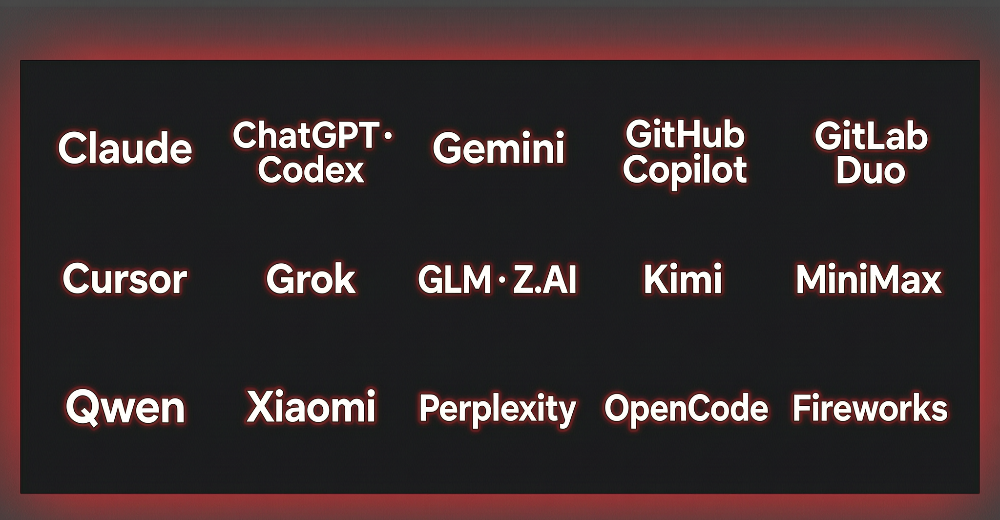

<p align="center">
  
</p>

<h1 align="center">Gajae-Code</h1>

<p align="center">
  <strong>Encode intention. Decode software.</strong><br />
  用你已经在付费的订阅计划驱动的编码代理 —— 还能在手机上作答。
</p>

<p align="center">
  <a href="https://gajae-code.com"></a>
  <a href="https://www.npmjs.com/package/gajae-code"></a>
  <a href="LICENSE"></a>
  <a href="https://discord.gg/8vPXmxSt9"></a>
</p>

<p align="center">
  <a href="README.md">English</a> | <a href="README.ko.md">한국어</a> | 中文 | <a href="README.ja.md">日本語</a>
</p>

> Gajae-Code 是一个实验性的 beta 阶段项目。可能存在粗糙之处，重要工作请先验证输出再依赖。
>
> 本文档是英文 [README.md](README.md) 的翻译版本。若内容不一致，以英文版为准（SSOT）。

Gajae-Code（`gjc`）是一个外置的编码代理运行器：在任意仓库或 worktree 中运行，先规划再改动，带着证据执行，并且可以从终端、手机或你自己的机器人随时掌控。

## 用你已有的编码订阅

<p align="center">
  
</p>

登录一次，就能用你已经订阅的计划运行 GJC，无需额外的 API 计费 —— 在会话中运行 `/login` 并选择提供商：

| 计划 / 订阅 | OAuth 登录 |
| --- | --- |
| Claude Pro / Max | `anthropic` |
| ChatGPT Plus / Pro (Codex) | `openai-codex`（浏览器）· `openai-codex-device`（无头） |
| Google Gemini CLI (Cloud Code Assist) | `google-gemini-cli` |
| GitHub Copilot | `github-copilot` |
| GitLab Duo | `gitlab-duo` |
| Cursor | `cursor` |
| xAI (Grok) | `xai` |
| 智谱 Z.AI GLM Coding Plan | `zai` |
| Kimi Code / Coding Plan / Moonshot | `kimi-code` · `moonshot` |
| Fire Pass（Fireworks Kimi K2.6 Turbo 订阅） | `firepass` |
| OpenCode Zen / OpenCode Go | `opencode-zen` · `opencode-go` |
| MiniMax Coding Plan（国际 / 中国） | `minimax-code` · `minimax-code-cn` |
| 阿里 Token Plan / Qwen Portal | `alibaba-token-plan` · `qwen-portal` |
| 小米 Token Plan（新加坡 / 欧洲 / 中国） | `xiaomi-token-plan-*` |
| Perplexity Pro / Max | `perplexity` |
| Command Code GOAT 编码计划 | `gjc setup` 预设 `commandcode-goat`（`CMD_API_KEY`） |

除 OAuth 计划外，还可以通过 API 密钥、本地运行时（Ollama、LM Studio、vLLM）和网关（Cloudflare AI Gateway、Vercel AI Gateway、LiteLLM 等）使用 50 多个提供商。在 `models.yml` 中注册自己的端点，为同一提供商配置多账号并按用量路由，用模型预设/配置文件按角色混用不同厂商，或用 auth broker/gateway 集中管理团队凭据。

- [模型、提供商与认证解析顺序](docs/models.md)
- [自定义提供商 & 多账号路由](docs/custom-providers-and-multi-account.md)
- [多厂商角色配置文件](docs/multi-vendor-profiles.md)
- [Auth broker & gateway（团队共享凭据）](docs/auth-broker-gateway.md)

## 在手机上作答

<p align="center">
  
</p>

当代理需要你做决定时，它会通过 Telegram 通知你 —— 你可以在任何地方作答：

- **按会话划分的论坛话题** —— 实时/最终输出、上下文更新、图片附件、内联按钮、自由文本回复、输入指示。
- **一次配置** —— 在运行中的会话里打开 `/settings` → Notifications，或无头方式使用 `gjc notify setup|status|health|test|recovery`。令牌输入时即被掩码，之后永不显示。
- **`gjc daemon`** —— 每个 bot 令牌只保留一个安全的 long-poll 所有者，新会话可以干净接入而不会触发 Telegram 409 冲突。
- 同时提供 Discord 和 Slack 投递；通用的 `action_needed`/`reply` 协议让任何机器人或移动应用都能把答案路由回来，无需抓取终端。

- [Telegram 接入](docs/telegram-onboarding.md) · [Discord](docs/discord-onboarding.md) · [Slack](docs/slack-onboarding.md)

## 花更少的 token

GJC 同时优化 token 账单的两端：

- **缓存命中** —— 按提供商控制 `cacheRetention`；Anthropic 默认长效（1 小时）缓存保留，因为短缓存对长时间代理运行很脆弱；提供商排序优先选择便宜的 `cacheRead` 路径；可选的 session-affinity 请求头让 OpenAI 兼容中继复用服务端提示词缓存。
- **上下文节省** —— 文件读取返回结构化摘要而非整个文件；超大 shell 输出会被最小化并溢出到可回取的 `artifact://` 引用，而不是灌满上下文；压缩（compaction）和分支摘要让长会话保持在窗口内且不丢失先前工作。

- [缓存保留 & 提供商兼容性](docs/models.md) · [压缩 & 分支摘要](docs/compaction.md)

## 改动之前先规划

刻意保持精简的工作流表面 —— 四个技能、四个角色代理，仅此而已：

```text
deep-interview -> ralplan -> ultragoal
                         └─ 当并行 tmux worker 有帮助时可选的 team 执行
```

| 表面 | 作用 |
| --- | --- |
| `deep-interview` | 把模糊的请求变成具体的需求。 |
| `ralplan` | 在改代码之前构建并批判实现计划。 |
| `ultragoal` | 跟踪目标的执行、修订、验证和证据。 |
| `team` | 在并行化值得时协调 tmux worker。 |
| `executor` / `architect` / `planner` / `critic` | 内置角色代理，覆盖实现与只读评审。 |

可选功能：**`gjc rlm`**（Jupyter 风格的研究/REPL 模式，自动合成 notebook 和报告）与 **`computer-use`**（实验性桌面控制）。见 [Python REPL](docs/python-repl.md) 和 [docs/tools/computer.md](docs/tools/computer.md)。

## 安装

```sh
bun install -g gajae-code
gjc
```

预构建二进制覆盖 Linux（x64/arm64）、macOS（arm64/x64）和 Windows（x64）；npm/Bun 路径在所有平台可用。Nightly 渠道：`bun install -g gajae-code@nightly`。

完整的安装矩阵、Windows 设置、更新渠道和 shell 补全：[docs/install.md](docs/install.md)。

## 快速开始

```sh
gjc                                # 在当前检出中运行
gjc --tmux                         # tmux 支撑的 leader 会话
gjc --tmux --worktree my-task      # 用隔离 worktree 做高风险工作
gjc @screenshot.png "我该改什么？"    # 图片输入
```

在会话内：

```text
/login                       选择提供商 / 编码计划
/skill:deep-interview        澄清模糊需求
/skill:ralplan               构建并批判计划
gjc ultragoal create-goals --brief-file <已批准的计划>
```

默认暗色 TUI 身份是 GJC red-claw 主题，亮色外观终端默认使用捆绑的 blue-crab 主题。更多主题从 Settings 或 `/theme` 选择。

## 让 OpenClaw / Hermes 驱动 GJC

GJC 内置原生 Coordinator MCP 桥，让 OpenClaw、Hermes 之类的外部控制器通过持久 turn 编排真实的 GJC 会话 —— 绝不抓取终端。

不需要读指南 —— 把下面这段提示词粘贴到你的 OpenClaw/Hermes 控制器里，让它自己完成接线：

```text
Set up Gajae-Code (gjc) as your coding-agent backend on this machine. gjc is already installed.

1. Render and install the coordinator MCP setup package (replace the paths):
   gjc setup hermes --root <ABS_REPO_PATH> --profile <PROFILE_NAME> --repo <REPO_NAME> \
     --mutation sessions,questions,reports --profile-dir <YOUR_PROFILE_DIR> --install
   Without --install the command is render-only; re-run with --install to write files.

2. Verify the contract (non-mutating, no LLM call). Both must report ok:
   gjc setup hermes --root <ABS_REPO_PATH> --smoke
   gjc mcp-serve coordinator --check --json

3. Register the MCP server from the installed config. It is equivalent to:
   command: gjc, args: ["mcp-serve", "coordinator"]
   env: GJC_COORDINATOR_MCP_WORKDIR_ROOTS=<ABS_REPO_PATH>,
        GJC_COORDINATOR_MCP_PROFILE=<PROFILE_NAME>,
        GJC_COORDINATOR_MCP_REPO=<REPO_NAME>,
        GJC_COORDINATOR_MCP_SESSION_COMMAND="gjc --worktree",
        GJC_COORDINATOR_MCP_MUTATIONS=sessions,questions,reports

4. To delegate coding work, prefer one call per workflow:
   gjc_delegate_plan / gjc_delegate_execute / gjc_delegate_team
   with { cwd, task, allow_mutation: true, idempotency_key: <fresh-uuid> }.
   Each starts an isolated worktree session and returns a durable turn_id and artifacts.

5. For finer control: gjc_coordinator_start_session -> gjc_coordinator_send_prompt ->
   poll gjc_coordinator_read_turn or bounded gjc_coordinator_await_turn ->
   answer gjc_coordinator_list_questions rows via gjc_coordinator_submit_question_answer ->
   close with gjc_coordinator_report_status.

Rules: every mutating call needs allow_mutation: true plus a fresh idempotency_key.
Treat durable turn state as authoritative; never scrape terminal output.
The session command selector accepts only "gjc" or "gjc --worktree [name]".
```

对于直接驱动单个实时会话的控制器，每个会话还暴露回环 **SDK WebSocket** 端点、`gjc sdk session` CLI（`list|inspect|send|status|tail`），以及内置的 `sdk-skills/`（`gjc-sdk-discover` · `gjc-sdk-operate` · `gjc-sdk-author`）—— 经过评审、带审批门控的流程，任何控制器上的代理都可以遵循。

- [外部控制器集成指南](docs/bot-integration.md) · [Coordinator MCP 桥](docs/hermes-mcp-bridge.md)
- [外部控制器 / 机器人](docs/bot-integration.md) — 提供商无关冒烟测试；[`docs/aside-integration.md`](docs/aside-integration.md) 涵盖可选的搜索/上下文边车
- [SDK & 线协议](docs/sdk.md) · [SDK 会话 CLI](docs/sdk-session-cli.md) · [外部控制就绪度](docs/external-control-readiness.md)

## 文档

从 **[gajae-code.com](https://gajae-code.com)** 或 `docs/` 开始：

- [安装 & 更新](docs/install.md) · [环境变量](docs/environment-variables.md) · [快捷键](docs/keybindings.md) · [主题](docs/theme.md)
- [模型 & 提供商](docs/models.md) · [自定义提供商 & 多账号路由](docs/custom-providers-and-multi-account.md) · [多厂商配置文件](docs/multi-vendor-profiles.md) · [Auth broker](docs/auth-broker-gateway.md)
- [Telegram](docs/telegram-onboarding.md) · [机器人集成](docs/bot-integration.md) · [SDK](docs/sdk.md) · [SDK 会话 CLI](docs/sdk-session-cli.md)
- [会话](docs/session.md) · [压缩](docs/compaction.md) · [记忆](docs/memory.md) · [密钥](docs/secrets.md)
- [代码库概览](docs/codebase-overview.md) · [贡献 / 开发环境](CONTRIBUTING.md)
- [macOS Option/Alt 键设置（iTerm2）](docs/macos-option-key.md) · [GEO 可见性基准](docs/geobench.md)

## SDK 扩展

- [gjc-remote](https://github.com/kogangdon/gjc-remote) —— 从 Discord 控制远程主机上白名单内的 GJC 会话。
- [oh-my-gajae-code](https://github.com/devswha/oh-my-gajae-code) —— 社区插件市场，安装额外技能和斜杠命令。
- [GJC 多厂商设置指南](https://github.com/project820/gjc-multivendor-setup-guide) —— 面向多厂商设置的基于角色的提供商配置文件。

## 开发

```sh
bun install
bun run build:native
bun run dev:link       # 全局 `gjc` 运行此检出的源码
bun run dev:doctor     # 验证链接
```

包结构图和门禁见 [CONTRIBUTING.md](CONTRIBUTING.md) 和 [docs/codebase-overview.md](docs/codebase-overview.md)。

## 贡献者 & 谱系

感谢 [Yeachan-Heo](https://github.com/Yeachan-Heo)、[IYENTeam](https://github.com/IYENTeam)、[HaD0Yun](https://github.com/HaD0Yun) 和 [probepark](https://github.com/probepark)。GJC 建立在一系列代理运行器的经验之上；历史归属见 [NOTICE.md](NOTICE.md)。

## 许可证

MIT。见 [LICENSE](LICENSE)。
